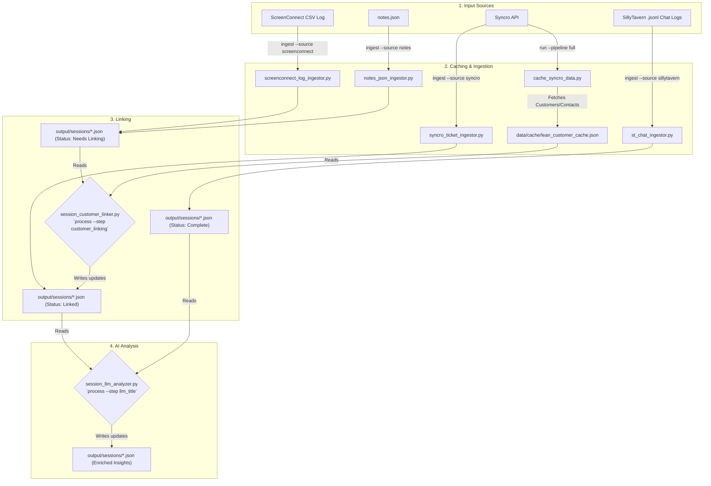

# Syncro Data Consolidator

**A modular data pipeline that consolidates events from multiple support platforms, links them to customers, and uses AI to summarize and categorize work sessions.**

## Overview

The Syncro Data Consolidator (SDC) is a Python-based tool designed to create a unified view of work performed across various systems like **Syncro RMM**, ScreenConnect, and other data sources. It ingests, **standardizes, and normalizes** raw data from diverse formats—including API calls, JSON, CSV, and JSONL files—into a structured "Session" format.

A key strength of this project is its intelligent, cost-effective approach to data processing. To link sessions to the correct customer, it employs a **local-first strategy**, using high-accuracy fuzzy matching before falling back on an LLM for only the most ambiguous cases. This dramatically reduces API costs and processing time.

The architecture is highly **modular and optimized for cost-efficiency**. This design provides granular control over operational costs, allowing powerful models to be used for complex tasks while leveraging lighter, faster models for simpler ones.

## Features

*   **Multi-Source Ingestion:** Processes data from a wide variety of sources and formats, including **Syncro RMM tickets (via API), ScreenConnect logs (CSV), legacy notes (JSON), and chat logs (JSONL).**
*   **Robust Chat Deduplication:** The SillyTavern ingestor uses a hashing mechanism to create a unique fingerprint for every message. This prevents the re-ingestion of duplicate messages across different chat files, snapshots, or branches, ensuring data integrity.
*   **Modular & Extensible Architecture:** Components are decoupled, making it easy to add new data sources or processing steps. The LLM API handler, for example, is self-contained, allowing for easy adaptation to any **chat completion** source, whether it's a comprehensive framework like **LangChain** or a direct, vendor-specific API.
*   **Intelligent Customer Linking:** Uses a sophisticated, local-first cascade logic:
    1.  **Exact Match:** First, it looks for a perfect name match.
    2.  **Fuzzy Match:** If no exact match is found, it uses a fuzzy logic algorithm that identifies the best match only if its confidence score is significantly higher than the next best alternative.
    3.  **AI Fallback:** Only for truly ambiguous cases does it make a call to an LLM, minimizing cost and latency.
*   **Cost-Optimized AI Analysis:** Leverages a configurable LLM (e.g., Google Gemini, local models) and allows you to assign different models to different tasks based on complexity. Use a cheap, fast model for simple categorization and a more powerful model for nuanced summarization.
*   **Stateful Processing:** Remembers which files and data have already been processed to avoid redundant work on subsequent runs.
*   **Centralized Logging:** All operations are logged, providing transparency and a clear audit trail for every processing step.
*   **Command-Line Interface:** Provides clear commands to run the entire pipeline or specific parts, such as ingesting new data or running analysis.

## Architecture

The project follows a multi-stage ETL (Extract, Transform, Load) pipeline. Raw data is ingested, converted into a standard format, enriched with customer information, and finally processed by an AI model.



## Project Structure

```
syncro_data_consolidator/
├── requirements.txt
├── config/              # Configuration files
├── data/                # All dynamic data: inputs, outputs, logs, cache
└── src/
    └── sdc/
        ├── run_sdc.py   # Main entry point and CLI
        ├── api_clients/ # Connectors for external APIs (e.g., Syncro)
        ├── ingestors/   # Scripts to read and standardize source data
        ├── llm/         # LLM prompt templates and API client logic
        ├── models/      # Pydantic data models (session_v2.py)
        ├── processors/  # Scripts for enrichment (linking, AI analysis)
        └── utils/       # Shared helper functions
```

## Installation & Setup

This project uses Conda for environment management.

1.  **Clone the repository:**
    ```bash
    git clone <your-repo-url>
    cd syncro_data_consolidator
    ```

2.  **Create and activate the Conda environment:**
    ```bash
    conda create --name sdc python=3.10
    conda activate sdc
    ```

3.  **Install dependencies:**
    ```bash
    pip install -r requirements.txt
    ```

4.  **Configure the application:**
    *   Copy `config/sampleconfig.json` to `config/config.json`.
    *   Edit `config/config.json` to add your Syncro RMM API credentials and adjust paths if necessary.
    *   Review `config/llm_configs.json` and add your LLM API keys.

## Usage

> **Important:** All commands should be run from the `src/` directory. This project is designed as a Python package, and running it from `src/` ensures that module imports like `from sdc.utils import ...` resolve correctly.

### Quick Start

The easiest way to run the entire pipeline is to use the `run` command. This will cache fresh Syncro RMM data, ingest all sources, and link customers.

```bash
# Navigate to the src directory first
cd src

# Run the full pipeline
python -m sdc.run_sdc run --pipeline full
```

After the `full` pipeline runs, you can perform AI analysis on the linked sessions:

```bash
# Generate titles for all linked sessions
python -m sdc.run_sdc process --step llm_title

# Generate summaries for all linked sessions
python -m sdc.run_sdc process --step llm_summary
```

### Command-Line Interface (CLI)

*   **Run a full pipeline:**
    *   `run --pipeline full`: Caches data, ingests all sources, links customers.
    *   `run --pipeline ingest_only`: Runs all ingestors without caching or linking.

*   **Run a specific ingestor:**
    *   `ingest --source <name>`: Sources: `syncro`, `screenconnect`, `notes`, `sillytavern`, `all`.
    *   Example: `python -m sdc.run_sdc ingest --source screenconnect`

*   **Run a specific processing step:**
    *   `process --step <name>`: Steps: `customer_linking`, `llm_title`, `llm_summary`, `all`.
    *   Example: `python -m sdc.run_sdc process --step customer_linking`

*   **Manage Caches:**
    *   `cache --source syncro`: Forces a refresh of the Syncro RMM customer data.

## Future Enhancements

*   **Work Item Grouping:** Implement a new processor to group related `Session` objects into a single "Work Item." This would consolidate billable events from different sources (e.g., a ticket, a remote session, and a follow-up note) into one structured entity, which can then be exported for invoicing or reporting.
*   **Data Redaction Module:** Add an optional processing step to automatically find and redact PII (Personally Identifiable Information) before data is sent to an external LLM, enhancing privacy.
*   **Test Suite:** Implement a full test suite with `pytest` to ensure reliability and simplify future development.

## License

This project is licensed under the terms of the MIT License.

**Copyright (c) 2025 Nick**