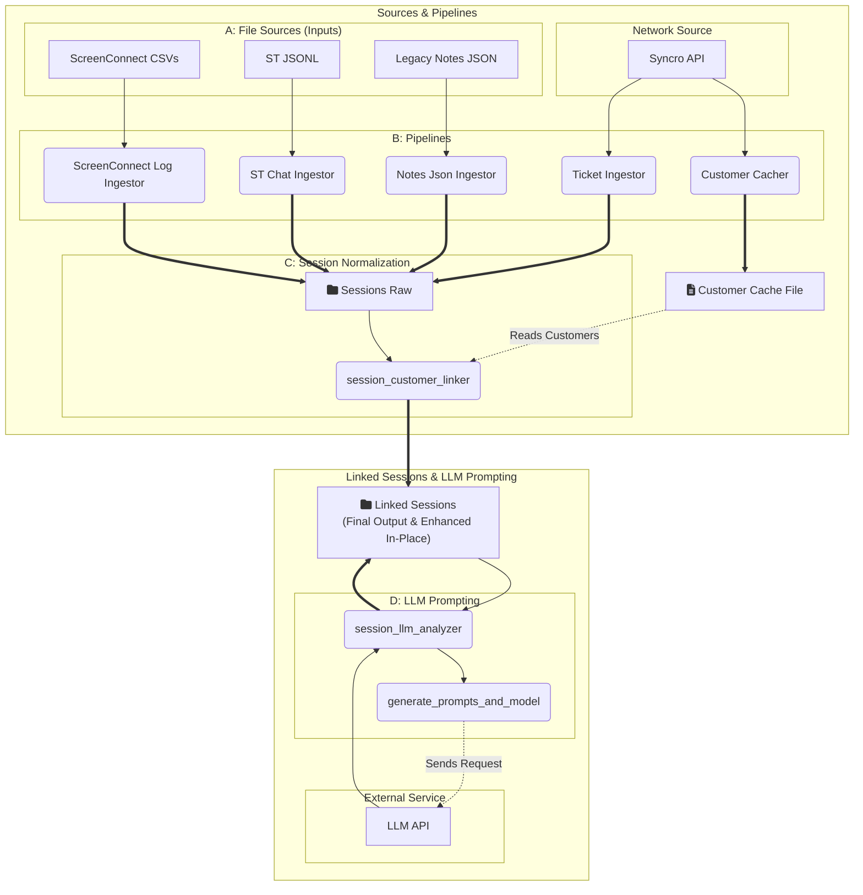

<!--
STAGING DRAFT — not the published README.

Proposed replacement for README.md, kept separate for review.
Merge into README.md when you're happy with it, then delete this file.
-->

# Syncro Data Consolidator

**A Python data pipeline that pulls work records from several support platforms, links them to the right customer, and uses an LLM to summarize and categorize each work session.**

## Overview

Support work gets logged in a lot of different places — tickets in Syncro RMM, remote session logs in ScreenConnect, chat transcripts, and older notes files. The Syncro Data Consolidator (SDC) reads all of those, converts them into one common record type called a **Session**, and works out which customer each one belongs to.

Two design choices shaped most of the project:

*   **Keep LLM calls to a minimum.** Customer linking tries an exact name match first, then fuzzy matching, and only asks an LLM when a name is genuinely ambiguous. Most records never trigger an API call.
*   **Make the model swappable.** Analysis tasks request a *capability* (`lightweight`, `general`, `complex`) rather than a named model, so you can point the project at Google Gemini or at a local model server without touching prompts or code.

## Features

*   **Multi-source ingestion:** Syncro RMM tickets (API), ScreenConnect logs (CSV export or API), legacy notes (JSON), and chat logs (JSONL).
*   **Customer linking:** A three-step cascade — exact match, then fuzzy match against the closest candidates, then an LLM call only if the result is still unclear.
*   **Chat deduplication:** Each message gets a hash-based fingerprint, so re-importing overlapping chat files or snapshots doesn't create duplicates.
*   **Configurable LLM provider:** Google Gemini or any OpenAI-compatible local server (LM Studio, Ollama, llama.cpp). One config value switches between them.
*   **Config-driven analysis tasks:** Each AI task — its prompt, model capability, and where the output goes — is defined in `config/llm_configs.yaml`. The CLI reads that file at startup, so adding a new analysis step means adding a YAML entry, not writing code.
*   **Incremental processing:** Tracks what's already been handled so re-runs don't redo finished work.
*   **Logging:** All steps write to a central log file.
*   **Workspace cleanup:** A `clean` command that previews by default and only deletes when given an explicit flag.

## Architecture

A multi-stage ETL pipeline. Raw data is ingested, converted to the Session format, matched to a customer, and then optionally sent through LLM analysis.



## Project Structure

```
syncro_data_consolidator/
├── requirements.txt
├── config/
│   ├── sampleconfig.yaml # Template -> copy to config.yaml (paths, credentials, provider)
│   └── llm_configs.yaml  # Analysis task definitions and prompt templates
├── data/                 # Inputs, outputs, logs, cache
├── tests/                # Unit tests
└── src/
    └── sdc/
        ├── run_sdc.py    # Entry point and CLI
        ├── api_clients/  # Syncro and ScreenConnect API clients
        ├── dev_tools/    # Maintenance scripts
        ├── ingestors/    # Read and standardize source data
        ├── llm/          # LLM client factory and prompt rendering
        ├── models/       # Pydantic data models (session_v2.py)
        ├── processors/   # Customer linking and AI analysis
        └── utils/        # Shared helpers
```

## Installation & Setup

This project uses Conda for environment management.

1.  **Clone the repository:**
    ```bash
    git clone https://github.com/nfuller286/syncro_data_consolidator.git
    cd syncro_data_consolidator
    ```

2.  **Create and activate the Conda environment:**
    ```bash
    conda create --name sdc python=3.10
    conda activate sdc
    ```

3.  **Install dependencies:**
    ```bash
    pip install -r requirements.txt
    ```

4.  **Configure the application:**
    *   Copy `config/sampleconfig.yaml` to `config/config.yaml`.
    *   Edit `config/config.yaml` with your Syncro RMM / ScreenConnect credentials and your LLM API key.
    *   `config.yaml` is gitignored, so credentials stay local.

    `config/llm_configs.yaml` holds the analysis task definitions and prompt text. It contains no credentials and normally doesn't need editing unless you're adding or reworking an analysis task.

## Configuration

### Choosing an LLM provider

`llm_provider_config.active_provider` in `config.yaml` picks the provider. Each provider maps the three capabilities to actual model names, so tasks stay provider-independent.

**Google Gemini:**

```yaml
llm_provider_config:
  active_provider: "google_gemini"
  google_gemini:
    api_key: "YOUR_KEY"
    models:
      complex: "gemini-2.5-pro"
      general: "gemini-2.5-flash"
      lightweight: "gemini-2.5-flash-lite"
```

**Local model server** — anything exposing an OpenAI-compatible endpoint (LM Studio, Ollama, llama.cpp, vLLM). Nothing leaves your network, and there's no per-token cost:

```yaml
llm_provider_config:
  active_provider: "local_llm"
  local_llm:
    base_url: "http://localhost:1234/v1"
    api_key: "NotNeeded"
    models:
      complex: "your-large-local-model"
      general: "your-mid-size-local-model"
      lightweight: "your-small-fast-local-model"
```

Model names have to match what your server actually reports. Most local servers ignore the API key, but the client still expects the field to be present. If you're only running one local model, it's fine to point all three capabilities at it.

## Usage

> All commands run from the `src/` directory, so that imports like `from sdc.utils import ...` resolve correctly.

### Quick start

```bash
cd src

# Cache Syncro data, ingest every source, link customers
python -m sdc.run_sdc run --pipeline full
```

LLM analysis is a separate step, so you can review the linked sessions before spending any API calls:

```bash
python -m sdc.run_sdc process --step title
python -m sdc.run_sdc process --step summary
```

### Commands

*   **Pipelines**
    *   `run --pipeline full` — cache, ingest all sources, link customers. Does not run LLM analysis.
    *   `run --pipeline ingest_only` — ingestors only.

*   **Ingest a single source**
    *   `ingest --source <syncro|screenconnect|notes|sillytavern|all>`
    *   ScreenConnect also accepts `--start-date`, `--end-date`, `--filter key=value` (repeatable), and `--show-filters` to list the valid filter keys. These are rejected for other sources, which use incremental state tracking instead.
    *   Example: `python -m sdc.run_sdc ingest --source screenconnect --filter ParticipantName=TechName`

*   **Processing steps**
    *   `process --step <name>` — `customer_linking`, `all`, plus every task defined in `llm_configs.yaml`: `title`, `summary`, `categorize`, `detailed_overview`, `notes_json_analysis`.
    *   The list comes from the config file at startup, so `process --help` always shows what's currently available.

*   **Cache**
    *   `cache --source syncro` — refresh cached Syncro customer data.

*   **Clean**
    *   `clean <sources...>` — remove generated files for one or more sources. Also accepts `all` and `logs`.
    *   Previews by default; add `--commit` to actually delete, which also asks for confirmation.
    *   Example: `python -m sdc.run_sdc clean screenconnect` then `... --commit`.

## Status & Roadmap

The ingestion, customer linking, and LLM analysis pipeline works end to end. Some pieces are built but not yet connected:

*   **SQLite index** — `utils/sqlite_indexer.py` defines the schema and `dev_tools/rebuild_index.py` populates `data/sdc.db` from the session files on disk. The pipeline itself still writes JSON; having the ingestors write to the database directly is the next step.
*   **Embeddings and vector search** — an embedding client factory and a FAISS wrapper exist under `llm/` and `utils/`, but nothing calls them yet. The goal is a `search` command for querying sessions in natural language.

Also planned:

*   **Work item grouping** — group related Sessions into a single billable "Work Item", so a ticket, a remote session, and a follow-up note about the same job become one entity for invoicing or reporting.
*   **PII redaction** — an optional step to strip identifying details before anything is sent to a cloud LLM. (Running a local provider already avoids sending data off-network.)
*   **Wider test coverage** — `tests/` currently covers `config_loader`, `date_utils`, and `file_utils`; the ingestors and processors aren't covered yet.

## Tech Stack

Python 3.10, Pydantic for the data models, LangChain for LLM clients (Google Gemini and OpenAI-compatible endpoints), `thefuzz` for fuzzy name matching, pandas, SQLite, and FAISS.
